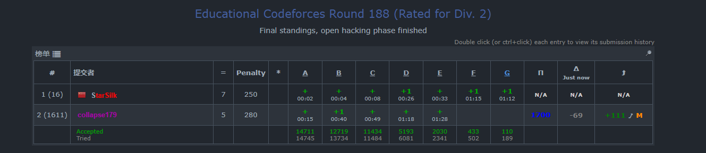

# 概要
赛时A-E，后续有空补充F,G


## [A. Passing the Ball](https://codeforces.com/contest/2204/problem/A) 

### 题目大意
给个长度为n的字符串，串中每个字符要么是'L'要么是'R'<br>根据给定的字符串模拟：
- 最开始球在第一个人手里
- $s_i$是L则向左传球，是R则向右传球。**数据已经保证最左是R，最右是L，也就是不需要考虑循环位移或者说超出界限的事情**

问执行n次之后有多少人拿到过球
### 思路
理解题意之后模拟即可
### 代码
```cpp
void solve() {
    int n; cin>>n;

    std::string s;
    cin>>s;
    s=" "+s;
    std::vector<bool>vis(n+1);
    int cur=1;
    int ans=0;
    for(int i=1;i<=n;i++){
        if(!vis[cur]){
            vis[cur]=true;
            ans++;
        }
        if(s[cur]=='R'){
            cur++;
        }else{
            cur--;
        }
    }

    cout<<ans<<endl;
}
```
## [B. Right Maximum](https://codeforces.com/contest/2204/problem/B)
### 题目大意
一个长度为n数组，每次删除数组最大值以及最大值右侧的所有数字(如果同时有多个最大值，则删除最右边的)，问要删除多少次才能删完
### 思路
顺着遍历，更新max，更新次数就是答案
### 代码
```cpp
void solve() {
    int n; cin>>n;

    std::vector<int>a(n+1);
    for(int i=1;i<=n;i++){
        cin>>a[i];
    }

    int ans=0;
    int mx=-2e9;
    for(int i=1;i<=n;i++){
        if(mx<=a[i]){
            // std::cerr<<i<<endl;
            ans++;
            mx=a[i];
        }
    }

    cout<<ans<<endl;
}
```
## [C. Spring](https://codeforces.com/contest/2204/problem/C)
### 题目大意
三个人按照自己的节奏打水(a每隔a天来打一次，b每隔b天来打一次水，c每隔c天来打一次水)，每天都是6升水，来的人平分，问m天之后每个人能打到多少升水
### 思路
简单容斥，先给每个人加上$6 * m$,然后考虑到一天两人相遇，原来假设分配给了每人6升，但其实他们每人只能拿3升。因此需要各自减去多算的3升，最后考虑一天有3人相遇,此时经过前面的加减：每人加了$6$升，然后都被减了次 $3$升，结果是$6-3-3=0$升。但三人相遇时他们应该每人分到$2$升水。所以要在最后通过$2 * (m / LCM(三人的频率))$把这部分水加回来
### 代码
```cpp
void solve() {
    ll a,b,c,m;
    cin>>a>>b>>c>>m;

    auto lcm = [&](ll x, ll y) -> ll {
        if (x > m || y > m) return m + 1;
        ll g = std::gcd(x, y);
        ll res = x / g * y;
        if (res > m) return m + 1;
        return res;
    };
    
    ll lcm_ab = lcm(a, b);
    ll lcm_bc = lcm(b, c);
    ll lcm_ac = lcm(a, c);
    ll lcm_abc = lcm(lcm_ab, c);

    ll WA = 6 * (m / a) - 3 * (m / lcm_ab) - 3 * (m / lcm_ac) + 2 * (m / lcm_abc);
    ll WB = 6 * (m / b) - 3 * (m / lcm_ab) - 3 * (m / lcm_bc) + 2 * (m / lcm_abc);
    ll WC = 6 * (m / c) - 3 * (m / lcm_ac) - 3 * (m / lcm_bc) + 2 * (m / lcm_abc);

    cout << WA << " " << WB << " " << WC << endl;
}
```
## [D. Alternating Path](https://codeforces.com/contest/2204/problem/D)
### 题目大意
给一个无向图的所有边定向。如果从顶点$v$出发的所有路径都满足“出边、入边、出边、入边”交替，则$v$是“美丽的”。求通过最优定向，最多能得到多少个“美丽”顶点？
### 思路
问题的核心是判断图的连通块是否为二分图。我们可以通过BFS对每个连通块进行染色，如果该连通块是二分图，则可以将所有边从其中一种颜色的顶点集合统一指向另一种颜色的顶点集合。这样，作为起点的集合中的所有顶点都会只包含出边，从这些点出发的路径走一步就会停止，天然满足“出入交替”的条件，从而成为“美丽”顶点。为了最大化美丽顶点的数量，我们只需要在二分图的两个集合中，选择顶点数量较多的那一个，将其大小累加到答案中即可；如果连通块不是二分图，则无法构造出满足条件的集合，贡献为0。
### 代码
```cpp
void solve() {
    int n, m;
    cin >> n >> m;
    std::vector<std::vector<int>> adj(n + 1);
    for (int i = 0; i < m; ++i) {
        int u, v;
        cin >> u >> v;
        adj[u].push_back(v);
        adj[v].push_back(u);
    }

    std::vector<int> color(n + 1, -1);
    int max_beautiful = 0;

    for (int i = 1; i <= n; ++i) {
        if (color[i] != -1) continue;
        
        std::vector<int> q = {i};
        color[i] = 0;
        int cnt[2] = {0, 0};
        bool is_bipartite = true;
        
        for (int head = 0; head < q.size(); ++head) {
            int u = q[head];
            cnt[color[u]]++;
            for (int v : adj[u]) {
                if (color[v] == -1) {
                    color[v] = color[u] ^ 1;
                    q.push_back(v);
                } else if (color[v] == color[u]) {
                    is_bipartite = false;
                }
            }
        }
        
        if (is_bipartite) {
            max_beautiful += std::max(cnt[0], cnt[1]);
        }
    }

    cout << max_beautiful << "\n";
}
```
## [E. Sum of Digits (and Again)](https://codeforces.com/contest/2204/problem/E)
### 题目大意
对于任意一个正整数 
$x$，可以按照以下规则生成一个字符串$S(x)$：
- 初始状态下字符串为空。
- 将当前$x$直接拼接到字符串的末尾。
- 如果当前 $x\le 9$，则过程结束。否则，将$x$替换为当前数字各个数位上的数字之和，然后回到步骤2继续进行。

求如何重排所给的数字串，能够还原出一个合法的“将每次数位和不断拼在后面的生成过程”
### 思路
最终完整的字符串是由原数 $X$ 拼接上 $S_1, S_2, \dots$ 构成的，其中 $S_1$ 是 $X$ 的数位和，$S_2$ 是 $S_1$ 的数位和，以此类推。
设给定所有字符的数字总和为 `tot`，显然有：`tot` = ($X$ 的数位和) + ($S_1, S_2, \dots$ 的数位和)。
由于 $X$ 的数位和正是 $S_1$，所以 `tot` $= S_1 + (S_1, S_2, \dots \text{的数位和})$。因为 $S_1$ 不会很大（极限情况下全为9，长度在 $10^5$ 级别，也不会超过几百万），所以 $S_1, S_2, \dots$ 贡献的数位和非常小，一般不会超过 200。
因此，我们可以直接暴力枚举 $S_1$（对应代码中的 $x_1$），范围在 `[max(1, tot - 200), tot]`。对每个候选的 $S_1$，模拟出后续的后缀串 $S_1 \parallel S_2 \dots$，检查该后缀串的数位是否能从可用字符集里扣除；如果可以，且剩下的可用字符数字之和刚好等于 $S_1$，也就是说明剩下的数字完全可以合法组成我们要的 $X$。最后为了保证 $X$ 没有前导零，只需取剩余数字中最小的非零字符作为开头，其余生序排列组成 $X$ 并拼上后缀串即可。

### 代码
```cpp
void solve() {
    std::string s;
    if (!(cin >> s)) return;
    
    if (s.length() == 1) {
        cout << s << endl;
        return;
    }
    
    std::vector<int> cnt(10, 0);
    int tot = 0;
    for (char c : s) {
        cnt[c - '0']++;
        tot += (c - '0');
    }
    
    auto sum_digits = [](int n) {
        int res = 0;
        while (n > 0) {
            res += n % 10;
            n /= 10;
        }
        return res;
    };
    
    for (int x1 = std::max(1, tot - 200); x1 <= tot; x1++) {
        std::string suff = "";
        int cur = x1;
        while (cur > 9) {
            suff += std::to_string(cur);
            cur = sum_digits(cur);
        }
        suff += std::to_string(cur);
        
        std::vector<int> rem = cnt;
        bool ok = true;
        int sum_suff = 0;
        for (char c : suff) {
            rem[c - '0']--;
            sum_suff += (c - '0');
            if (rem[c - '0'] < 0) {
                ok = false;
                break;
            }
        }
        
        if (ok && tot - sum_suff == x1) {
            std::string ans = "";
            for (int i = 1; i <= 9; i++) {
                if (rem[i] > 0) {
                    ans += std::to_string(i);
                    rem[i]--;
                    break;
                }
            }
            for (int i = 0; i <= 9; i++) {
                while (rem[i] > 0) {
                    ans += std::to_string(i);
                    rem[i]--;
                }
            }
            ans += suff;
            cout << ans << endl;
            return;
        }
    }
}
```