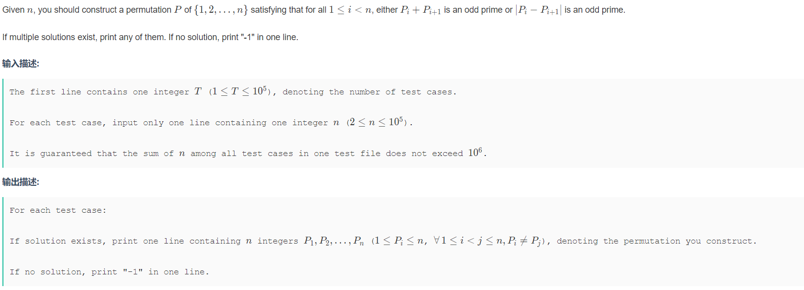
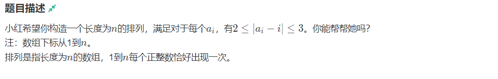

> [!TIP]
>
> 严格来说本文更新于2023/8/13，想起来这篇比较有意思就从学校OJ的博客搬过来了<br>

[Permutation and Primes](http://https://ac.nowcoder.com/acm/contest/57362/J "Permutation and Primes")
<br>
# 题目大意
让你构造一个长度为N的排列a，要求$a_i$+$a_{i+1}$或者|$a_i$-$a_{i+1}$|为除二以外的素数，若构造不出，则输出-1(动动脚趾头想都知道绝对构造的出来)
# 解法
官方正解是找规律找构造规律
奈何本蒟蒻打表看了半天还看不出哪里有规律QAQ
但是在开了这题的时候，自己满脑子都是另外一个构造序列的题目
[忽远忽近的距离](http://https://ac.nowcoder.com/acm/contest/46811/C "忽远忽近的距离")

这道题的官方解法也是找规律构造序列，但是本蒟蒻也在打的时候找不出来，但是看到排列，瞬间联想到DFS找全排列，但你直接去暴力枚举每一个排列，不管是上面还是下面那道，铁T。
先从下面一题入手，他要求2≤|$a_i$-i|≤3，所以我们可以对DFS进行一点修改，对于每个I，我们只枚举i+2,i+3,i-2,i-3，只要这四个数中有一个在规定范围内(即1≤$a_i$≤n)，我们便把这个树放到第i位上，若没有，则回溯一下
所以忽远忽近的距离就可以这么写
```cpp
#define AAAAAA ios::sync_with_stdio(0), cin.tie(0);
#define pb(x) push_back(x);
#include<bits/stdc++.h>
using namespace std;
typedef long long ll;
typedef __int128 i128;
const int N=1e5+10;

int n;
int vis[N];
int ans[N];
int dir[6]={-2,-3,2,3};
void dfs(int step){
    if(step==n+1){
        for(int i=1;i<=n;i++){
            cout<<ans[i]<<" ";
        }
        exit(0);
    }
    for(int i=0;i<4;i++){
        int next=step+dir[i];
        if(vis[next]||next<=0||next>n) continue;
        vis[next]=1;
        ans[step]=next;
        dfs(step+1);
        vis[next]=0;
    }
    if(step==1) cout<<"-1";
}
void solve() {
    cin>>n;
    dfs(1);
}
signed main() {
    AAAAAA;
    int _ = 1;
    //cin >> _;
    for (int i = 1; i <= _; i++) {
        solve();
    }
    return 0;
}
```
运行时间17ms 还是挺优秀的 对.......吧？

让我们回到这题，根据这题的限定条件，所以我们枚举$a_i$-7，$a_i$-5，$a_i$+3，$a_i$+5这四个元素(为什么没有$a_i$-3? 你想一想，我在$a_i$枚举到了$a_i$-3，那在我们枚举到$a_{i+1}$ 时$a_{i+1}$+3是直接continue掉的，基本相当于无用功，所以我没把他放进去)
但这样枚举的话，前7个DFS是构造不出符合条件序列的，所以得特判一下，可能8~1e6也会有没有造出来的，本蒟蒻没有实际去测过，但是本蒟蒻知道，这样写不会T
于是本题代码便诞生了(好像就是在讲歪理QAQ 所以这篇题解基本就是图一乐)
```cpp
#include<bits/stdc++.h>
using namespace std;
#define pb push_back
typedef long long ll;
//#define int ll
#define endl "\n"
const int N=1e5+10;
const int mod=998244353;
typedef __int128 i128;

int n;
int ans[N];
bool vis[N];
int dir[N]={-7,-5,3,5};
bool flag;

void print(){
    for(int i=1;i<=n;i++) cout<<ans[i]<<" ";
    cout<<endl;
    flag=1;
}
void dfs(int step,int now) {
    if(flag) return;
    if (step == n + 1) {
        print();
        return;
    }
    for(int i=0;i<=3;i++){
        int next=now+dir[i];
        if(next<1||next>n) continue;
        if(vis[next]) continue;
        vis[next]=1;
        ans[step]=next;
        dfs(step+1,next);
        vis[next]=0;
    }
}
void solve(){
    cin>>n;
    if(n<=7){
        if(n==2) cout<<"1 2\n";
        if(n==3) cout<<"1 2 3\n";
        if(n==4) cout<<"1 2 3 4\n";
        if(n==5) cout<<"5 2 1 4 3\n";
        if(n==6) cout<<"1 2 5 6 3 4\n";
        if(n==7) cout<<"1 2 3 4 7 6 5\n";
    }else {
        flag=0;
        ans[1] = 1;
        vis[1] = 1;
        dfs(2, 1);
    }
}
signed main () {
    ios::sync_with_stdio(false);cin.tie(nullptr);cout.tie(nullptr);
    int _=1;
    cin>>_;
    for(int __=1;__<=_;__++){
        solve();
        memset(vis,0,sizeof(vis));
    }
    return 0;
}
```
运行时间 261ms 还算可以.........吧QAQ