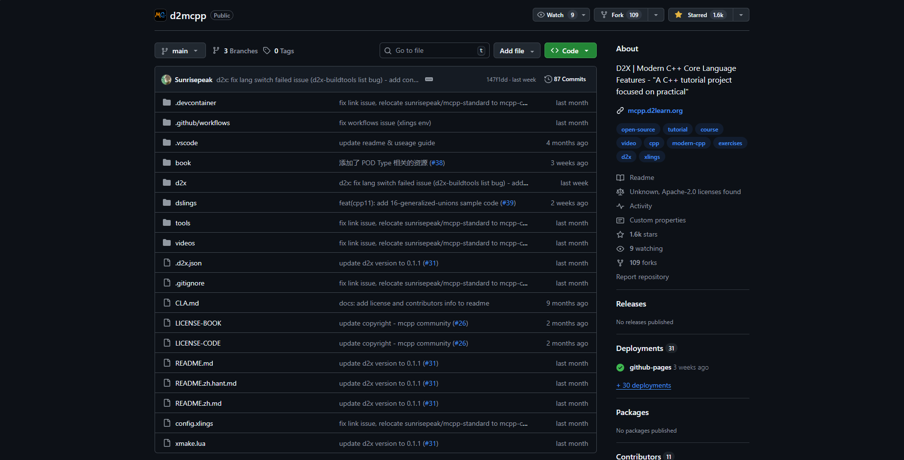
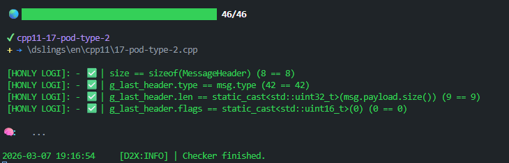
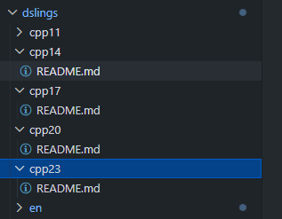

> [!TIP]
>
> **本文仅仅只记录完成一个教程之后的感想，并没有相关题解**<br>
> 教程本身比较简单，而且还可以配置AI辅助，比较闲可以试试：https://mcpp.d2learn.org/
## 整体评价
起因是某天晚上睡不着觉躺在床上刷手机，然后就发现了这个项目
<br> 这个项目本意就是让你更好的通过写的方式了解现代CPP的特TIP性，而且全程几乎是自动化的，还有自己的讨论社区。
在这之前我自己对于CPP的了解更多来自于自己写的GAMES101作业以及C++ Primer Plus，可以说就只是把CPP当成C With Class用了。本着对C++这一坨的敬畏心态，我打开了他们准备好的练习题。<br>在花了几天时间断断续续的完成所有练习以及阅读相关文档之后，先对这个教程做个整体评价：简单的带你了解了一下`decltype()`与`auto`的一些用法和推导规则，再用一些简单练习带你了解右值和移动语义的一些用法，接着再用一些练习告诉你CPP的模板参数推导和一些其他的杂项比如`nullptr`、广义联合体、列表初始化和POD类型。可以说是带你大致了解一些CPP除对象之外的特性以及告诉你规范化的CPP写法（可能是？），但是CPP肯定不只是这些，有了模板这种编译期生成代码的大杀器，有一种叫SIFNAE的玩法，但是很可惜，目前d2mcpp并没有关于这方面的练习。深究项目的文件结构，可以发现，目前这些练习还是只有CPP11，而他们还画了CPP14+之后的饼，希望能早点吃到吧<br><br>除了练习之外，他们还准备了动画和教程文档，建议配合食用。为了更好的教学，他们还准备了一个技术论坛用来讨论CPP，目前上面也有一些优质文档比如教学cpp基础多线程相关<br><br>
## AI辅助
基本上你只需要在DEEPSEEK或者别的地方充点钱然后在`d2x.json`配置api-key和api-url就可以使用了，项目维护者已经写好了提示词，正常来说AI会在你改动代码之后给予你一些提示，有些题目甚至AI会直接告诉你答案，如果说只做练习的话，建议还是不开启AI辅助。
## 练习方式
下载好项目之后输入`d2x checker`就自动打开上一次停下的地方继续练习，所有测试点完成之后注释或删除`D2X WAIT`就可以进入下一道练习题，美中不足的地方在于，测试点是直接暴露在主函数中的，也就是说你可以根据测试点反推答案，而不是根据文件开头注释得出答案
### 一些有意思的题目
事实上除了`decltype()`和右值的具体内容之外,其余的内容基本都在C++ Primer Plus这本书上出现并且有较为完善的用例与讲解,但是书本配套的练习使用了蓝桥的系统导致可用性大幅下降,看完那本书之后也是压根没有打开在线练习的欲望(<br>相比之下,d2mcpp至少有让人想继续做下去的欲望
回到正题上,46个练习里面其实最有意思的就是一个关于函数返回值的题目,CPP目前在我的映像里还是容易在左值右值方面发狂,这道题长这样
```cpp
// d2mcpp: https://github.com/mcpp-community/d2mcpp
// license: Apache-2.0
// file: dslings/cpp11/05-move-semantics-0.cpp
//
// Exercise/练习: cpp11 | 05 - move semantics | 移动构造与触发时机
//
// Tips/提示: 观察编译器输出, 在不改变buff传递的逻辑, 使得只做一次资源的分配和释放
//
// Docs/文档:
//   - https://en.cppreference.com/w/cpp/language/move_constructor
//
// Auto-Checker/自动检测命令:
//
//   d2x checker move-semantics
//

// #include <d2x/cpp/common.hpp>

#include <iostream>

struct Buffer {
    int *data;
    Buffer() : data { new int[2] {0, 1} } {
        std::cout << "Buffer():" << data << std::endl;
    }
    Buffer(const Buffer &other)  {
        std::cout << "Buffer(const Buffer&):" << data << std::endl;
        data = new int[2];
        data[0] = other.data[0];
        data[1] = other.data[1];
    }
    Buffer(Buffer&& other) : data { other.data } { 
        std::cout << "Buffer(Buffer&&):" << data << std::endl;
        other.data = nullptr; // 让原对象的指针失效
    }
    ~Buffer() {
        if (data) {
            std::cout << "~Buffer():" << data << std::endl;
            delete[] data;
        }
    }
    const int * data_ptr() const { return data; }
};

Buffer process(Buffer buff) {
    std::cout << "process(): " << buff.data << std::endl;
    return buff;
}

int main() {
    {
        Buffer buff1 = process(Buffer());
        auto buff1DataPtr = buff1.data_ptr();

        std::cout << " --- " << std::endl;

        Buffer buff2(std::move(buff1));
        auto buff2DataPtr = buff2.data_ptr();

        // d2x_assert(buff1DataPtr == buff2DataPtr);

        Buffer buff3 = buff2;
        auto buff3DataPtr = buff3.data_ptr();

        // d2x_assert(buff2DataPtr == buff3DataPtr);

        Buffer buff4 = process(buff3);
        auto buff4DataPtr = buff4.data_ptr();

        // d2x_assert(buff3DataPtr == buff4DataPtr);
    }

    // D2X_WAIT

    return 0;
}
```
观察最开始的运行的结果:
```
--- 
Buffer():0x1f222172380
process(): 0x1f222172380
Buffer(Buffer&&):0x1f222172380
--- 
```
可以发现 `buff1` 的构建实际上调用的是移动构造函数。最开始会在这里产生一个疑问：在 `process` 函数中，形参 `buff` 具有名字，明明通常被视为一个左值（lvalue），为什么返回时却能触发移动构造呢？

这是因为 C++11 之后对返回值引入了特别的规则：
- 参数传递时的复制省略：我们调用 `process(Buffer())` 传入一个纯右值临时对象，编译器进行了复制省略，直接在 `process` 的参数 `buff` 所在的内存位置调用了默认构造函数，所以一开始输出了 `Buffer()`，省去了一次拷贝。
- 返回时的隐式的右值转换：当执行 `return buff;` 时，虽然 `buff` 本身在函数体内是一个左值，但它是一个即将被销毁的、拥有自动存储期的局部变量（函数参数也包含在内）。[C++ 标准规定](https://en.cppreference.com/w/cpp/language/return)，遇到**按值返回局部变量或参数**时，编译器必须首先将其作为右值来进行重载决议进行匹配。你可以近似把它理解为编译器在返回时隐式地为你做了一次 `std::move(buff)` 。
- 命中移动构造：在进行这一步隐式的右值身份赋予后，初始化外部正在等待接收的 `buff1` 时，因为传入的是“右值”，毫无疑问优先且合法地匹配到了自身的移动构造函数，这极大程度上避免了重新分配内存做深拷贝带来的高昂开销。
在知道这一特性之后，我们就可以开始完成这段代码让它只构建一次对象，避免分配:
```cpp
int main() {
    {
        Buffer buff1 = process(Buffer());
        auto buff1DataPtr = buff1.data_ptr();

        std::cout << " --- " << std::endl;

        Buffer buff2(std::move(buff1));
        auto buff2DataPtr = buff2.data_ptr();

        // d2x_assert(buff1DataPtr == buff2DataPtr);

        Buffer&& buff3 = std::move(buff2);
        auto buff3DataPtr = buff3.data_ptr();

        // d2x_assert(buff2DataPtr == buff3DataPtr);

        Buffer buff4 = process(std::move(buff3));
        auto buff4DataPtr = buff4.data_ptr();

        // d2x_assert(buff3DataPtr == buff4DataPtr);
    }


    return 0;
}
```
### 又是一些题外话
之前说到cpp对于左值右值非常容易发狂，比如下面这段代码:
```cpp
#include<iostream>
using namespace std;


void f(float&& x){
    cout<<"f";
}
void f(int&& x){
    cout<<"i";
}

template<typename ... T>
void g(T && ... args){
    (f((args)),...);
}


int main(){
    g(1.0f,2);
    return 0;
}
```
可以保证，这段代码的输出是`if`，即使我们在调用`g()`的时候，确实是传入的右到不能再右的右值，但是在最终函数调用下，却发现`1.0f`调用的是`void f(int&& x)`,而`2`调用的相反，借助cpp insight,我们发现模板生成了如下代码：
```cpp
#ifdef INSIGHTS_USE_TEMPLATE
template<>
void g<float, int>(float && __args0, int && __args1)
{
  f(static_cast<int>((__args0))) , f(static_cast<float>((__args1)));
}
#endif
```
通常情况下，作为一个包裹和转发参数的模板，理应使用 `std::forward` 来实现完美转发。但在上面未做完美转发的例子中，函数匹配的结果却发生错位，显得极其诡异。<br>这背后的根本原因在于 C++ 中处理值类别的一条核心规则：带有名字的右值引用，其本身是一个左值。<br>在模板函数 `g` 内部，参数 `args` 虽然通过万能引用解析并折叠成了右值引用，但由于它在函数体内拥有具体的变量名，如果在继续向内传参时不经过处理，它的表现形式依然是左值。由于左值的 `float` 无法直接绑定到右值引用签名 `f(float&&)` 上，处于“发狂”状态的编译器只能退而求其次寻找隐式转换方案：将其隐式转换为 `int` 类型的临时右值，反而阴差阳错地成功匹配并调用了 `f(int&&)` 类型。这十分生动地展示了在 C++ 中遗漏 `std::forward` 会造成多大的麻烦。
## 配套文档
如果你选择练一下这些题目，那么我非常推荐你去看一下他们的配套文档，个人认为信息量要比题目本身要多，如果说在某道题卡住了或者不确定自己的做法是正确的，那么完全就可以查找配套文档，一定会有答案的
## 未来展望
CPP这一坨的东西还是挺多的，模板元编程，内存管理,STL等等，仅仅这46道练习题是肯定不够学习的，官方也保证会更新，后续只需要`d2x update`指令就可以拉取新的练习，新的文档，新的动画，只能继续期待后续的更新了。