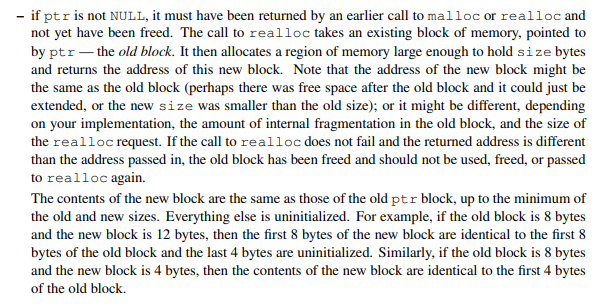

> [!CAUTION]
>
> **免责声明：此文章为记录自主学习malloc机制而留，并没有提交到任何评测机，使用的数据是来自Arthals提供的PKU的包，尚不清楚在别的测评数据的评测情况，请勿直接复制粘贴，后果自负。**

## 这个lab,要我们做什么？
简单来说就是不用libc的malloc相关包函数实现一个简单的动态内存分配器,但是我们可以使用以下三个函数：
 - ``void* mem_heap_lo()`` :指向堆底的指针
 - ``void* mem_heap_hi()`` :指向堆顶的指针
 - ``void* mem_sbrk(int incr)`` :扩展堆incr个单位，返回旧堆顶指针
。在PKU的版本中，要求我们更改``mm.c``文件来实现：``mm_init``、``malloc``、``free``、``realloc``、``calloc``这5个基础函数，但是通常来说，因为需要Debug，所以还需要实现``mm_checkheap``函数来检查自己堆分配是否和预期一样执行（~~反正我也没有助教团队给我测试分说是~~）。
这个版本的lab的评分公式是：
$$
P\left(U,T\right)=100\left.\left(0.6\min\left(1,\frac{U-0.7}{0.2}\right)+0.4\min\left(1,\frac{T-4000}{10000}\right)\right)\right.
$$其中U和T分别代表：
 - 内存利用率，即驱动程序使用的内存总量（仅计入有效载荷，也就是实际装载数据的部分，不包括头部，脚部之类的）与分配器使用的堆大小之间的**峰值比率**，最佳比率等于1。
 - 吞吐量：每秒完成的平均操作次数。
 综上所述，我们的终极目标就是让这个内存分配器的内存利用率$U\ge0.7$，吞吐量$T\ge14000$<br>为了实现最大化内存利用率和吞吐量，我们需要在减少碎片和降低操作开销之间取得平衡。提高U和T的关键并不是让每次分配尽可能小，而是通过合理的块组织方式、有效的空闲链表结构和合适的分配策略来减少内部与外部碎片，并降低搜索、分割和合并的成本。

 ## 我们该怎么开始？
 在解压文件之后其实就可以动手开始写代码了，不过在动手之前先想想我们该怎么实现这个内存分配器，需要维护什么？需要优化什么？<br>对于以上问题，我们可以看到书本的9.9部分动态内存分配(P587 - P605)这一部分还提供了隐式空闲链表的实现。
 在阅读完书本的这一部分之后，我们大致了解到一个内存块的构成，也可以基本确定我们要实现一个显式空闲链表，同时也了解到了分离存储来减少分配时间的方法。

 ## 我们该怎么设计块结构？
 对于一个堆块的设计，书本给出了一个叫带边界标记，实际上就是在只有头部的块的基础上添加一个脚部，方便我们在合并空闲块的时候快速定位到前一个块的头部和确认这个块是不是空闲的<div align="center"></div><br>根据书本描述：这个块因为有向8字节对齐，所以低三位是必定为0的，所以我们可以在这低三位做文章：比如把最低位标记为这个块是不是已分配的，把次低位设计为前一个块是不是已分配的。但实际上我们这个块还有优化的空间：脚部并不会被计入有效载荷，所以我们可以在已分配的块中**舍弃脚部**。因为我们通过自己的块的头部就可以知道前一个块有没有被分配，那既然是已经分配块，我们也没必要根据它的脚部去跳到前一个块的头部了。
 因为我们使用显式空闲链表，所以对于空闲块，我们需要放两个指针，一个指向前一个块，一个指向后一个块，在64位系统中，我们的一个指针就占8个字，两个指针就占16个字，最小块就来到了24字节，这是极大的一个空间浪费。事实上，我们可以通过偏移的方式，不存储64位的完整指针，而是存储相对于``mem_heap_lo()``的4字节偏移量，从而将两个指针压缩到8个字，这样我们就让最小块来到了16字。又省下一点空间同时不影响匹配，皆大欢喜！

 ## 我们该怎么组织这些块
 书中介绍了两种分离存储的方式：
 ### 简单分离存储
将**大小相等**的块分到一组，例如一个大小类的定义为{17~32}，那这个类的空闲链表就全由大小为32的块组成。这样做非常简单，不分割不合并，申请和释放都是常数的时间，同时也不需要向前的指针和维护已分配的头部信息，自然也就不会有脚部，因此最小块大小就是一个字。但是这样做很容易造成非常多的碎片。
 ### 分离适配
 使用这种方法，分配器维护着一个空闲链表的数组(放在堆的开头而不是.DATA段)。每个空闲链表和一个大小类相关联，每个链表包含潜在的**大小不同**的块。匹配流程见下流程图<div align="center"></div><br>注意到书本说GNU的malloc包就是这种分离适配方法，那我们接下来的实验其实就可以参照这个流程来实现分离适配的方法了。<div align="center"></div><br>
 #### 伙伴系统
 伙伴系统实际也是分离适配的一种，但是它有点特别，因为它的块的大小都是2的幂次，虽然能优化搜索和合并但是会产生很多内部碎片，在这就不多做赘述了。
## 那现在这个堆长什么样？
根据之前的分析，我们大致知道这个堆要先在开头放空闲链表，然后防止对齐，然后根据书本，我们还需要序言头和序言结尾，这两块是永不释放的，同时结尾还要有一个特殊的大小为0的已分配块作为结尾块(P597最后一段)。具体我们可以看下图，也许更有助于理解<div align="center"></div><br>

## 正式动手！
### 写个宏先
由于涉及大部分指针运算，而指针的语法糖比较神人，所以我们最好先定义一些宏辅助我们进行指针运算
首先书本已经给出了部分隐式链表的宏
```c
/* Basic constants and macros */
#define WSIZE       4       /* 单字，同时也是头部/脚部的大小 */
#define DSIZE       8       /* 双字 */
#define CHUNKSIZE   (1<<12) /* 申请一片新的堆内存大小 */

#define MAX(x, y) ((x) > (y)? (x) : (y)) //取max

/* 将块大小信息和是否分配信息包装 */
#define PACK(size, alloc)  ((size) | (alloc)) 

/* 对p指向的内容的读写 */
#define GET(p)       (*(unsigned int *)(p))
#define PUT(p, val)  (*(unsigned int *)(p) = (val))

/* 拿到P指向的块的大小 */
#define GET_SIZE(p)  (GET(p) & ~0x7)
#define GET_ALLOC(p) (GET(p) & 0x1)

/* 获得P块头部和脚部 */
#define HDRP(bp)       ((char *)(bp) - WSIZE)
#define FTRP(bp)       ((char *)(bp) + GET_SIZE(HDRP(bp)) - DSIZE)

/* 给到块的指针，计算前一个块的地址和后一个块的地址 */
#define NEXT_BLP(bp)  ((char *)(bp) + GET_SIZE(((char *)(bp) - WSIZE)))
#define PREV_BLP(bp)  ((char *)(bp) - GET_SIZE(((char *)(bp) - DSIZE)))
```
可以看到,隐式空闲链表已经辅助实现了单双字定义还有大小比对、获取指针内容、指针赋值、给定有效载荷获取头尾部、和上下两个块的尾部或者头部。对于PACK，因为显式空闲链表的倒数第二位还需要维护前一块是否被分配的信息，所以PACK还需要更改
```C
#define PACK(size, prev_allocated, alloc) ((size) | (prev_allocated) | (alloc))
```
为了方便查询倒数第二位，所以我们还可以定义一组宏来查询倒数第二位
```c
#define GET_PREV_ALLOC(p) (GET(p) & 0x2)
```
为了方便配合合并，释放等操作对头部位的修改，我们还可以定义一组宏:
```c
#define SET_ALLOC(p) (GET(p) |= 0x1)
#define SET_FREE(p) (GET(p) &= ~0x1)
#define SET_PREV_ALLOC(p) (GET(p) |= 0x2)
#define SET_PREV_FREE(p) (GET(p) &= ~0x2)
```
因为显式空闲链表还需要维护一个数组来维护各个类的空闲链表的开头，但是LAB禁止使用全局数组，所以我们只能声明一个指针来来表示数组头部，为了方便取其余数组地址，我们可以定义宏来来实现类似于``[]``的操作
```c
// 地址和偏移量的转化
#define ADDR_TO_OFFSET(p) ((p) ? (unsigned int)((char *)(p) - (char *)mem_heap_lo()) : 0)
#define OFFSET_TO_ADDR(off) ((off) ? ((char *)mem_heap_lo() + (off)) : NULL)

// 从堆起始位置访问空闲链表根节点的宏
#define GET_ROOT(i) (OFFSET_TO_ADDR(*((unsigned int *)(mem_heap_lo()) + (i))))
#define SET_ROOT(i, val) (*((unsigned int *)(mem_heap_lo()) + (i)) = ADDR_TO_OFFSET(val))
```
同时因为我们的双向链表存储的是偏移量而不是直接存储指针，所以我们也需要一个根据偏移来获取和赋值的宏
```c
// 指针压缩宏 
// 存储相对于 mem_heap_lo() 的偏移量，而不是完整指针 
#define GET_PTR_OFFSET(p) (*(unsigned int *)(p)) 
#define PUT_PTR_OFFSET(p, val) (*(unsigned int *)(p) = (val))
```
为了方便向8的倍数对齐,我们还定义了一个ALGIN宏
```c
#define ALIGN(p) (((size_t)(p) + (ALIGNMENT - 1)) & ~0x7)
```
至此，我们也是完成了第一步的流程。
对于分离适配链表，我们还需要确认该如何对大小类分块，此处不多赘述，只能分析样例然后得到神秘优化了:
```c
static int get_seg_index(size_t size)
{
    if (size <= 24) return 0;
    if (size <= 32) return 1;
    if (size <= 64) return 2;
    if (size <= 80) return 3;
    if (size <= 120) return 4;
    if (size <= 240) return 5;
    if (size <= 480) return 6;
    if (size <= 960) return 7;
    if (size <= 1920) return 8;
    if (size <= 3840) return 9;
    if (size <= 7680) return 10;
    if (size <= 15360) return 11;
    if (size <= 30720) return 12;
    if (size <= 61440) return 13;
    return 14;
}
```
至此终于可以开始填写任务函数了
### 该初始化了
初始化要干的事情其实非常简单:
 - 初始化空闲链表数组
 - 在开头放上序言头部尾部和结尾块头部
 - 扩展CHUNKSIZE的堆大小然后再在最后放结尾块
我们先干前两件事：
```c
    int list_size = NUM_CLASSES * WSIZE;

    if ((heap_listp = mem_sbrk(ALIGN(list_size) + 4 * WSIZE)) == (void *)-1)
        return -1;

    for (int i = 0; i < NUM_CLASSES; i++) {
        SET_ROOT(i, NULL);
    }

    heap_listp += ALIGN(list_size);

    PUT(heap_listp, 0);                               // 填充对齐
    PUT(heap_listp + (1 * WSIZE), PACK(DSIZE, 1, 1)); // 序言块头部
    PUT(heap_listp + (2 * WSIZE), PACK(DSIZE, 1, 1)); // 序言块脚部
    PUT(heap_listp + (3 * WSIZE), PACK(0, 2, 1));     // 结尾块头部
    heap_listp += (2 * WSIZE);
```
现在我们就要实现第三步扩展堆大小
```c
static void *extend_heap(size_t words)
{
    char *bp;

    size_t size = (words % 2) ? (words + 1) * WSIZE : words * WSIZE;//保证对齐
    if ((long)(bp = mem_sbrk(size)) == -1)
        return NULL;

    // 拿到前一个块的信息,之后写头部要用
    size_t prev_allocated = GET_PREV_ALLOC(HDRP(bp)); 
    
    PUT(HDRP(bp), PACK(size, prev_allocated, 0));
    PUT(FTRP(bp), PACK(size, prev_allocated, 0));
    
    // 新结尾块
    PUT(HDRP(NEXT_BLKP(bp)), PACK(0, 0, 1)); 

    return coalesce(bp);
}
```
可以看到我们在扩展堆之后还会尝试合并块，但是回想合并的操作，如果遇到了合并，就要把对应的链表节点删除,以及更新前后指针（准确来说是偏移）的操作。
### 我们还要先实现删除可合并的节点的操作
显式空闲链表要求我们在分配块（将空闲块变为已分配）或合并块（改变块的大小或位置）时，显式地从链表中添加或删除节点。这里我们实现标准的双向链表删除和插入操作。
```c
static void remove_free_block(void *bp)
{
    size_t size = GET_SIZE(HDRP(bp));
    int index = get_seg_index(size);
    char *pred = GET_PRED(bp);
    char *succ = GET_SUCC(bp);

    if (pred != NULL) {
        SET_SUCC(pred, succ);
    } else {
        SET_ROOT(index, succ);
    }

    if (succ != NULL) {
        SET_PRED(succ, pred);
    }
}
```
### 完善LIFO的链表操作
为了维护LIFO的顺序，我们要把新的块插入到对于链表的头部
```c
static void insert_free_block(void *bp)
{
    size_t size = GET_SIZE(HDRP(bp));
    int index = get_seg_index(size);
    char *root = GET_ROOT(index);

    if (root != NULL) {
        SET_PRED(root, bp);
    }
    SET_SUCC(bp, root);
    SET_PRED(bp, NULL);
    SET_ROOT(index, bp);
}

```
### 所以我们现在该实现合并了
合并（Coalescing）是减少外部碎片、生成更大空闲块的关键机制。当释放一个块时，我们需要检查它的前后邻居是否也是空闲的。
根据前后块的分配状态，存在四种情况：
1.  **前后都已分配**：无法合并，直接将当前块加入空闲链表。
2.  **后块空闲，前块已分配**：将当前块与后一个块合并。需要从链表中移除后一个块，更新当前块大小，并加入链表。
3.  **前块空闲，后块已分配**：将前一个块与当前块合并。需要从链表中移除前一个块（实际上在我们的实现中，是利用前一个块的头部直接扩展大小，所以不需要移除再插入，只需要更新大小），但为了逻辑统一，通常会先移除旧的空闲块，合并后再插入新的。
4.  **前后都空闲**：将前、中、后三个块合并为一个大块。

```c
static void *coalesce(void *bp)
{
    // 确认前面一个块是不是空闲的
    size_t prev_allocated = GET_PREV_ALLOC(HDRP(bp));
    // 确认下一个块是不是空闲的
    size_t next_alloc = GET_ALLOC(HDRP(NEXT_BLKP(bp)));
    size_t size = GET_SIZE(HDRP(bp));

    if (prev_allocated && next_alloc) {
        // 两边都合并，不需要特殊操作
    }
    else if (prev_allocated && !next_alloc) {
        // 后一个块是空的
        remove_free_block(NEXT_BLKP(bp));
        size += GET_SIZE(HDRP(NEXT_BLKP(bp)));
        PUT(HDRP(bp), PACK(size, 2, 0)); // 放2相当于放10，就设置了第二位
        PUT(FTRP(bp), PACK(size, 2, 0));
    }
    else if (!prev_allocated && next_alloc) {
        // 前一块是空的
        remove_free_block(PREV_BLKP(bp));
        size += GET_SIZE(HDRP(PREV_BLKP(bp)));
        size_t prev_prev_allocated = GET_PREV_ALLOC(HDRP(PREV_BLKP(bp)));
        PUT(HDRP(PREV_BLKP(bp)), PACK(size, prev_prev_allocated, 0));
        PUT(FTRP(bp), PACK(size, prev_prev_allocated, 0));
        bp = PREV_BLKP(bp);
    }
    else {
        // 前后都是空的
        remove_free_block(PREV_BLKP(bp));
        remove_free_block(NEXT_BLKP(bp));
        size += GET_SIZE(HDRP(PREV_BLKP(bp))) + GET_SIZE(HDRP(NEXT_BLKP(bp)));
        size_t prev_prev_allocated = GET_PREV_ALLOC(HDRP(PREV_BLKP(bp)));
        PUT(HDRP(PREV_BLKP(bp)), PACK(size, prev_prev_allocated, 0));
        PUT(FTRP(NEXT_BLKP(bp)), PACK(size, prev_prev_allocated, 0));
        bp = PREV_BLKP(bp);
    }
    
    // 合并后，确保下一个块的第二位是设置为0
    SET_PREV_FREE(HDRP(NEXT_BLKP(bp)));
    //别忘了把点插入回链表头部
    insert_free_block(bp);
    return bp;
}
```
### 有点恶心的malloc函数
为什么说恶心呢，因为PKU加了恶意trace数据，导致你常规的对8的倍数对齐取整会拿不到对应分数，不翻对应博客或者说直接分析数据都不知道有这东西，虽然PDF说不让干特判之类的事情~~但是本校学生都干了，我有什么理由不干.jpg~~

`malloc` 的核心流程如下：
1.  **对齐与调整**：将用户请求的 `size` 加上头部和脚部的大小`DSIZE`，并向上对齐到双字（8字节）的倍数。
2.  **搜索空闲链表**：根据调整后的大小`asize`，计算出对应的分离链表索引。从该索引开始，遍历分离链表数组。对于每个链表，使用**首次适配**策略查找第一个满足大小要求的空闲块。
3.  **适配与分割**：
    *   如果找到了合适的块，检查剩余空间`block_size - asize`是否足够容纳一个最小的空闲块（16字节）。
    *   如果足够，则**分割**：将当前块的前 `asize` 部分标记为已分配，剩余部分作为一个新的空闲块插入链表。
    *   如果不足，则**不分割**：将整个块分配给用户，剩余的一点空间作为内部碎片。
4.  **扩展堆**：如果遍历完所有链表都没找到合适的块，则调用 `extend_heap` 扩展堆空间，并在新扩展的区域中进行分配。

```c
void *malloc(size_t size)
{
    size_t asize, extendsize;
    char *bp;

    if (heap_listp == 0) {
        mm_init();
    }
    if (size == 0)
        return NULL;

    size = adjust_alloc_size(size);

    if (size <= DSIZE)
        asize = 2 * DSIZE;
    else
        asize = DSIZE * ((size + (WSIZE) + (DSIZE - 1)) / DSIZE);

    // 搜寻链表，使用第一适配原则
    int index = get_seg_index(asize);
    for (int i = index; i < NUM_CLASSES; i++) {
        bp = GET_ROOT(i);
        while (bp != NULL) {
            if (GET_SIZE(HDRP(bp)) >= asize) {
                // 找到了
                size_t csize = GET_SIZE(HDRP(bp));
                size_t remainder = csize - asize;
                remove_free_block(bp);
                
                if (remainder >= 2 * DSIZE) { // 最小块大小保证
                    // 分割
                    size_t prev_alloc = GET_PREV_ALLOC(HDRP(bp));
                    PUT(HDRP(bp), PACK(asize, prev_alloc, 1));
                    
                    void *next_bp = NEXT_BLKP(bp);
                    PUT(HDRP(next_bp), PACK(remainder, 2, 0));
                    PUT(FTRP(next_bp), PACK(remainder, 2, 0));
                    
                    insert_free_block(next_bp);
                } else {
                    // 不分割
                    size_t prev_alloc = GET_PREV_ALLOC(HDRP(bp));
                    PUT(HDRP(bp), PACK(csize, prev_alloc, 1));
                    SET_PREV_ALLOC(HDRP(NEXT_BLKP(bp)));
                    if (!GET_ALLOC(HDRP(NEXT_BLKP(bp)))) {
                         SET_PREV_ALLOC(FTRP(NEXT_BLKP(bp)));
                    }
                }
                return bp;
            }
            bp = GET_SUCC(bp);
        }
    }

    extendsize = (asize > CHUNKSIZE) ? asize : CHUNKSIZE;
    if ((bp = extend_heap(extendsize / WSIZE)) == NULL)
        return NULL;
        
    size_t csize = GET_SIZE(HDRP(bp));
    size_t remainder = csize - asize;
    remove_free_block(bp);
    
    if (remainder >= 2 * DSIZE) {
        size_t prev_alloc = GET_PREV_ALLOC(HDRP(bp));
        PUT(HDRP(bp), PACK(asize, prev_alloc, 1));
        
        void *next_bp = NEXT_BLKP(bp);
        PUT(HDRP(next_bp), PACK(remainder, 2, 0));
        PUT(FTRP(next_bp), PACK(remainder, 2, 0));
        insert_free_block(next_bp);
    } else {
        size_t prev_alloc = GET_PREV_ALLOC(HDRP(bp));
        PUT(HDRP(bp), PACK(csize, prev_alloc, 1));
        SET_PREV_ALLOC(HDRP(NEXT_BLKP(bp)));
        if (!GET_ALLOC(HDRP(NEXT_BLKP(bp)))) {
             SET_PREV_ALLOC(FTRP(NEXT_BLKP(bp)));
        }
    }

    return bp;
}
```
关于对于特殊样例的判断，可以参考[Arthals的描述](https://arthals.ink/blog/malloc-lab#%E8%B0%83%E6%95%B4%E5%88%86%E9%85%8D%E5%A4%A7%E5%B0%8F-adjust_alloc_sizesize)链接已经完成定位了
### 难以理解的realloc
原来文字还可以这么排列，受教了<div align="center"></div><br>至少没某年赛马娘狗屎说是
真实意图应该是要我在新块比旧块大的时候尝试原地扩展~~但是实际上不扩就可以拿满，那我扩个鸡毛啊.JPG~~
```c
void *realloc(void *ptr, size_t size)
{
    size_t oldsize;
    void *newptr;

    if (size == 0) {
        free(ptr);
        return 0;
    }
    if (ptr == NULL) {
        return malloc(size);
    }

    newptr = malloc(size);
    if (!newptr) {
        return 0;
    }

    oldsize = GET_SIZE(HDRP(ptr));
    if (size < oldsize) oldsize = size; //小了就截断
    memcpy(newptr, ptr, oldsize);
    free(ptr);
    return newptr;
}
```
### 比较轻松的calloc
在实现以上几个函数之后，我们看看calloc的要求：分配一个数组，然后初始化为0，然后返回指针，哪来的签到
```c
void *calloc(size_t nmemb, size_t size)
{
    size_t bytes = nmemb * size;
    void *newptr;

    newptr = malloc(bytes);
    memset(newptr, 0, bytes);

    return newptr;
}
```
### 别忘了释放
>小趣事一则：笔者在面试的时候面试官放了一个CPP的代码，里面的问题有很多，但是最关键的就是申请了内存但是没有free（在CPP其实基本写delete或者delete[]了，因为CPP有狗屎Big five）,就这问题当时没看出来，可想而知结果是怎么样的了。面试八股也有一道常考题叫free只传入指针并没有传入size，那机器怎么知道要释放多少？相信系统学习了CSAPP的人对于这个问题应该是能答出完美答案的吧。
根据书本，free要干的事情有：
 - 先从头部获取块大小
 - 将下一个块的第二位设置为0
 - 更新指针与合并并且插入链表
在本文中，第三步的事情已经交给了合并函数来处理了，所以我们只用按照手册来实现前两步
```c
void free(void *bp)
{
    if (bp == 0)
        return;
    if (heap_listp == 0) {
        mm_init();
        return;
    }

    size_t size = GET_SIZE(HDRP(bp));
    size_t prev_alloc = GET_PREV_ALLOC(HDRP(bp));

    PUT(HDRP(bp), PACK(size, prev_alloc, 0));
    PUT(FTRP(bp), PACK(size, prev_alloc, 0));
    
    SET_PREV_FREE(HDRP(NEXT_BLKP(bp)));
    if (!GET_ALLOC(HDRP(NEXT_BLKP(bp)))) {
        SET_PREV_FREE(FTRP(NEXT_BLKP(bp)));
    }

    coalesce(bp);
}
```
### 我们已经实现了80分了
到现在，我们其实已经可以使用测试指令来测试这个屎山跑起来怎么样了
```bash
Results for mm malloc:
  valid  util   ops    secs     Kops  trace
   yes    86%  100000  0.004799 20838 ./traces/alaska.rep
 * yes    99%    4805  0.000069 69950 ./traces/amptjp.rep
 * yes    83%    4162  0.000124 33695 ./traces/bash.rep
 * yes    77%   57716  0.001001 57648 ./traces/boat.rep
 * yes    78%  100000  0.001949 51310 ./traces/boat-plus.rep
 u yes    90%      --        --    -- ./traces/binary2-bal.rep
 * yes    99%    5032  0.000060 83205 ./traces/cccp.rep
 * yes    99%    5848  0.000075 78116 ./traces/cccp-bal.rep
 * yes    76%   11991  0.000408 29370 ./traces/chrome.rep
 * yes    99%   20000  0.000309 64679 ./traces/coalesce-big.rep
   yes    66%   14400  0.000243 59251 ./traces/coalescing-bal.rep
   yes   100%      15  0.000001 17483 ./traces/corners.rep
 * yes    99%    5683  0.000280 20308 ./traces/cp-decl.rep
 u yes    71%      --        --    -- ./traces/exhaust.rep
 * yes   100%    5380  0.000280 19224 ./traces/expr-bal.rep
 * yes    84%   99544  0.003161 31493 ./traces/firefox-reddit2.rep
 * yes    98%   55092  0.001485 37111 ./traces/freeciv.rep
   yes    34%      10  0.000001 16611 ./traces/malloc.rep
   yes    28%      17  0.000001 27553 ./traces/malloc-free.rep
 p yes     --    1494  0.000040 37252 ./traces/perl.rep
 * yes    93%    4800  0.000436 11012 ./traces/random.rep
 * yes    92%    4800  0.000292 16430 ./traces/random2.rep
   yes    30%   14401  0.046331   311 ./traces/realloc.rep
16 15     90%  386347  0.009968 38758

Perf index = 60 (util) & 40 (thru) = 100/100
```
至于CHECK_HEAP函数，下次吧，时间紧任务重，以后有机会再写

## 写到最后（段错误的可以看看这里）
如果哪一天真有人找到了这篇博客，这是我一点关于段错误的经验：
- 请你认真检查，是不是每个块都严格按照8个字节的对齐
- 请你检查扩展堆的时候是不是正确的把特殊的结尾堆放了进去
- **空闲链表指针写爆了**

这份代码整体上和Arthals的思路是一样的（都是用偏移量来压缩指针，都是分离适配空闲链表，都是去除已分配的块的脚部），只是一部分实现的细节上有出入，至于我为什么要写，主要还是这lab真的太难了，找了各路参考资料才实现了一份自己的，写出来先段错误一会然后就调对了发现只有87分，然后就开始凹了一晚上，~~有种跟人pvp的美~~，写这一篇也有充实博客内容的意思，不过更多是为了留恋这个卡我贼久的lab。

## 相关链接
[Arthals-更适合北大宝宝体质的Malloc Lab踩坑记](https://arthals.ink/blog/malloc-lab)
[Elainafan-从零开始的Malloc Lab](https://www.elainafan.one/p/%E4%BB%8E%E9%9B%B6%E5%BC%80%E5%A7%8B%E7%9A%84malloc-lab/)