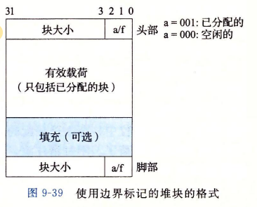
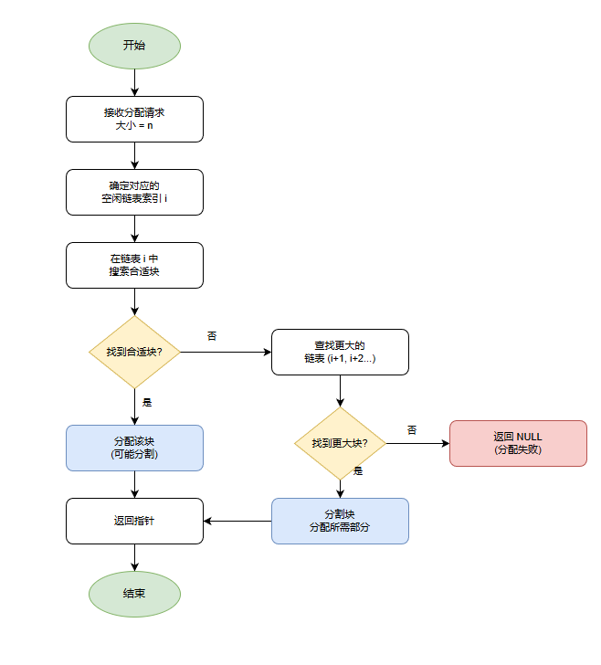

> [!CAUTION]
>
> **免责声明：此文章为记录自主学习malloc机制而留，并没有提交到任何评测机，使用的数据是来自Arthals提供的PKU的包，尚不清楚在别的测评数据的评测情况，请勿直接复制粘贴，后果自负。**

## 这个lab,要我们做什么？
简单来说就是不用libc的malloc相关包函数实现一个简单的动态内存分配器,但是我们可以使用以下三个函数：
 - ``void* mem_heap_lo()`` :指向堆底的指针
 - ``void* mem_heap_hi()`` :指向堆顶的指针
 - ``void* mem_sbrk(int incr)`` :扩展堆incr个单位，返回旧堆顶指针
。在PKU的版本中，要求我们更改``mm.c``文件来实现：``mm_init``、``malloc``、``free``、``realloc``、``calloc``这5个基础函数，但是通常来说，因为需要Debug，所以还需要实现``mm_checkheap``函数来检查自己堆分配是否和预期一样执行（~~反正我也没有助教团队给我测试分说是~~）。
这个版本的lab的评分公式是：
$$
P\left(U,T\right)=100\left.\left(0.6\min\left(1,\frac{U-0.7}{0.2}\right)+0.4\min\left(1,\frac{T-4000}{10000}\right)\right)\right.
$$其中U和T分别代表：
 - 内存利用率，即驱动程序使用的内存总量（仅计入有效载荷，也就是实际装载数据的部分，不包括头部，脚部之类的）与分配器使用的堆大小之间的**峰值比率**，最佳比率等于1。
 - 吞吐量：每秒完成的平均操作次数。
 综上所述，我们的终极目标就是让这个内存分配器的内存利用率$U\ge0.7$，吞吐量$T\ge14000$<br>为了实现最大化内存利用率和吞吐量，我们需要在减少碎片和降低操作开销之间取得平衡。提高U和T的关键并不是让每次分配尽可能小，而是通过合理的块组织方式、有效的空闲链表结构和合适的分配策略来减少内部与外部碎片，并降低搜索、分割和合并的成本。

 ## 我们该怎么开始？
 在解压文件之后其实就可以动手开始写代码了，不过在动手之前先想想我们该怎么实现这个内存分配器，需要维护什么？需要优化什么？<br>对于以上问题，我们可以看到书本的9.9部分动态内存分配(P587 - P605)这一部分还提供了隐式空闲链表的实现。
 在阅读完书本的这一部分之后，我们大致了解到一个内存块的构成，也可以基本确定我们要实现一个显式空闲链表，同时也了解到了分离存储来减少分配时间的方法。

 ## 我们该怎么设计块结构？
 对于一个堆块的设计，书本给出了一个叫带边界标记，实际上就是在只有头部的块的基础上添加一个脚步，方便我们在合并空闲块的时候快速定位到前一个块的头部和确认这个块是不是空闲的<div align="center"></div><br>根据书本描述：这个块因为有向8字节对齐，所以低三位是必定为0的，所以我们可以在这低三位做文章：比如把最低位标记为这个块是不是已分配的，把次低位设计为前一个块是不是已分配的。但实际上我们这个块还有优化的空间：脚部并不会被计入有效载荷，所以我们可以在已分配的块中**舍弃脚部**。因为我们通过自己的块的头部就可以知道前一个块有没有被分配，那既然是已经分配块，我们也没必要根据它的脚部去跳到前一个块的头部了。
 因为我们使用显示空闲链表，所以对于空闲块，我们需要放两个指针，一个指向前一个块，一个指向后一个块，在64位系统中，我们的一个指针就占8个字，两个指针就占16个字，最小块就来到了24字节，这是极大的一个空间浪费。事实上，我们可以通过偏移的方式，不存储64位的完整指针，而是存储相对于``mem_heap_lo()``的4字节偏移量，从而将两个指针压缩到8个字，这样我们就让最小块来到了16字。又省下一点空间同时不影响匹配，皆大欢喜！

 ## 我们该怎么组织这些块
 书中介绍了两种分离存储的方式：
 ### 简单分离存储
将**大小相等**的块分到一组，例如一个大小类的定义位{17~32}，那这个类的空闲链表就全由大小为32的块组成。这样做非常简单，不分割不合并，申请和释放都是常数的时间，同时也不需要向前的指针和维护已分配的头部信息，自然也就不会有脚部，因此最小快大小就是一个字。但是这样做很容易造成非常多的碎片。
 ### 分离适配
 使用这种方法，分配器维护者一个空闲链表的数组(放在堆的开头而不是.DATA段)。每个空闲链表和一个大小类相关联，每个链表包含潜在的**大小不同**的块。匹配流程见下流程图<div align="center"></div><br>注意到书本说GNU的malloc包就是这种分离适配方法，那我们接下来的实验其实就可以参照这个流程来实现分离适配的方法了。<div align="center"></div><br>
 #### 伙伴系统
 伙伴系统实际也是分离适配的一种，但是它有点特别，因为它的块的大小都是2的幂次，虽然能优化搜索和合并但是会产生很多内部碎片，在这就不多做赘述了。
## 那现在这个堆长什么样？
根据之前的分析，我们大致知道这个堆要先在开头放空闲链表，然后防止对齐，然后根据书本，我们还需要序言头和序言结尾，这两块是永不释放的，同时结尾还要有一个特殊的大小为0的已分配块作为结尾块(P597最后一段)。具体我们可以看下图，也许更有助于理解<div align="center"></div><br>

## 正式动手！
### 写个宏先
由于涉及大部分指针运算，而指针的语法糖比较神人，所以我们最好先定义一些红辅助我们进行指针运算
首先书本已经给出了部分隐式链表的宏
```c
/* Basic constants and macros */
#define WSIZE       4       /* 单字，同时也是头部/脚部的大小 */
#define DSIZE       8       /* 双字 */
#define CHUNKSIZE   (1<<12) /* 申请一片新的堆内存大小 */

#define MAX(x, y) ((x) > (y)? (x) : (y)) //取max

/* 将块大小信息和是否分配信息包装 */
#define PACK(size, alloc)  ((size) | (alloc)) 

/* 对p指向的内容的读写 */
#define GET(p)       (*(unsigned int *)(p))
#define PUT(p, val)  (*(unsigned int *)(p) = (val))

/* 拿到P指向的块的大小 */
#define GET_SIZE(p)  (GET(p) & ~0x7)
#define GET_ALLOC(p) (GET(p) & 0x1)

/* 获得P块头部和脚部 */
#define HDRP(bp)       ((char *)(bp) - WSIZE)
#define FTRP(bp)       ((char *)(bp) + GET_SIZE(HDRP(bp)) - DSIZE)

/* 给到块的指针，计算前一个块的地址和后一个块的地址 */
#define NEXT_BLP(bp)  ((char *)(bp) + GET_SIZE(((char *)(bp) - WSIZE)))
#define PREV_BLP(bp)  ((char *)(bp) - GET_SIZE(((char *)(bp) - DSIZE)))
```
可以看到,隐式空闲链表已经辅助实现了单双字定义还有大小比对、获取指针内容、指针赋值、给定有效载荷获取头尾部、和上下两个块的尾部或者头部。对于PACK，因为显式空闲链表的倒数第二位还需要维护前一块是否被分配的信息，所以PACK还需要更改
```C
#define PACK(size, prev_alloc, alloc) ((size) | (prev_alloc) | (alloc))
```
为了方便查询倒数第二位，所以我们还可以定义一组宏来查询倒数第二位
```c
#define GET_PREV_ALLOC(p) (GET(p) & 0x2)
```
为了方便配合合并，释放等操作对头部位的修改，我们还可以定义一组宏:
```c
#define SET_ALLOC(p) (GET(p) |= 0x1)
#define SET_FREE(p) (GET(p) &= ~0x1)
#define SET_PREV_ALLOC(p) (GET(p) |= 0x2)
#define SET_PREV_FREE(p) (GET(p) &= ~0x2)
```
因为显式空闲链表还需要维护一个数组来维护各个类的空闲链表的开头，但是LAB禁止使用全局数组，所以我们只能声明一个指针来来表示数组头部，为了方便取其余数组地址，我们可以定义宏来来实现类似于``[]``的操作
```c
// 地址和偏移量的转化
#define ADDR_TO_OFFSET(p) ((p) ? (unsigned int)((char *)(p) - (char *)mem_heap_lo()) : 0)
#define OFFSET_TO_ADDR(off) ((off) ? ((char *)mem_heap_lo() + (off)) : NULL)

// 从堆起始位置访问空闲链表根节点的宏
#define GET_ROOT(i) (OFFSET_TO_ADDR(*((unsigned int *)(mem_heap_lo()) + (i))))
#define SET_ROOT(i, val) (*((unsigned int *)(mem_heap_lo()) + (i)) = ADDR_TO_OFFSET(val))
```
同时因为我们的双向链表存储的是偏移量而不是直接存储指针，所以我们也需要一个根据偏移来获取和赋值的宏
```c
// 指针压缩宏 
// 存储相对于 mem_heap_lo() 的偏移量，而不是完整指针 
#define GET_PTR_OFFSET(p) (*(unsigned int *)(p)) 
#define PUT_PTR_OFFSET(p, val) (*(unsigned int *)(p) = (val))
```
至此，我们也是完成了第一步的流程
## 该初始化了
初始化要干的事情其实非常简单:
 - 初始化空闲链表数组
 - 在开头放上序言头部尾部
 - 扩展CHUNKSIZE的堆大小然后在尾部放上特殊的结尾块
我们先干前两件事：
```c
int list_size = NUM_CLASSES * WSIZE;

    if ((heap_listp = mem_sbrk(ALIGN(list_size) + 4 * WSIZE)) == (void *)-1)
        return -1;

    for (int i = 0; i < NUM_CLASSES; i++) {
        SET_ROOT(i, NULL);
    }

    heap_listp += ALIGN(list_size);

    PUT(heap_listp, 0);                            // Alignment padding
    PUT(heap_listp + (1 * WSIZE), PACK(DSIZE, 1, 1)); // Prologue header (Prev alloc, Curr alloc)
    PUT(heap_listp + (2 * WSIZE), PACK(DSIZE, 1, 1)); // Prologue footer
    PUT(heap_listp + (3 * WSIZE), PACK(0, 2, 1));     // Epilogue header (Prev alloc, Curr alloc)
    heap_listp += (2 * WSIZE);
```