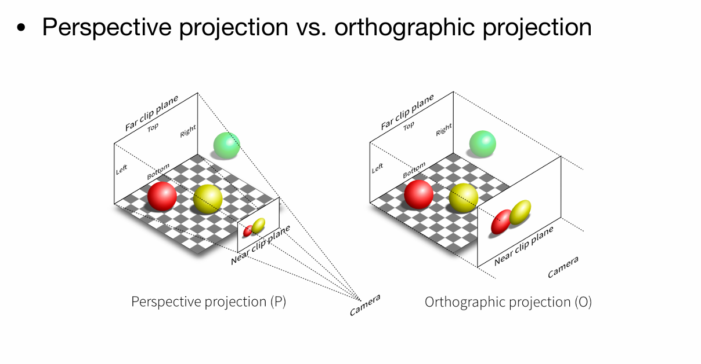
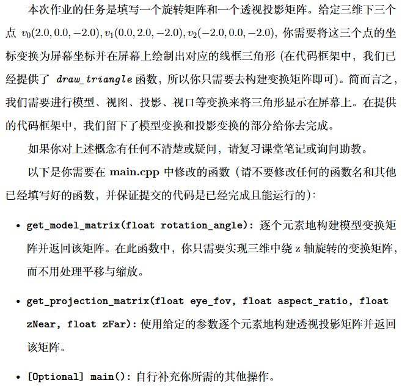
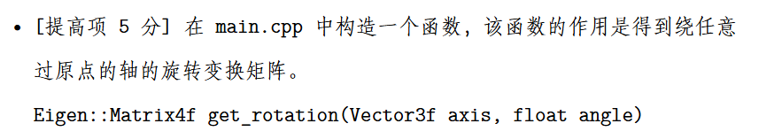
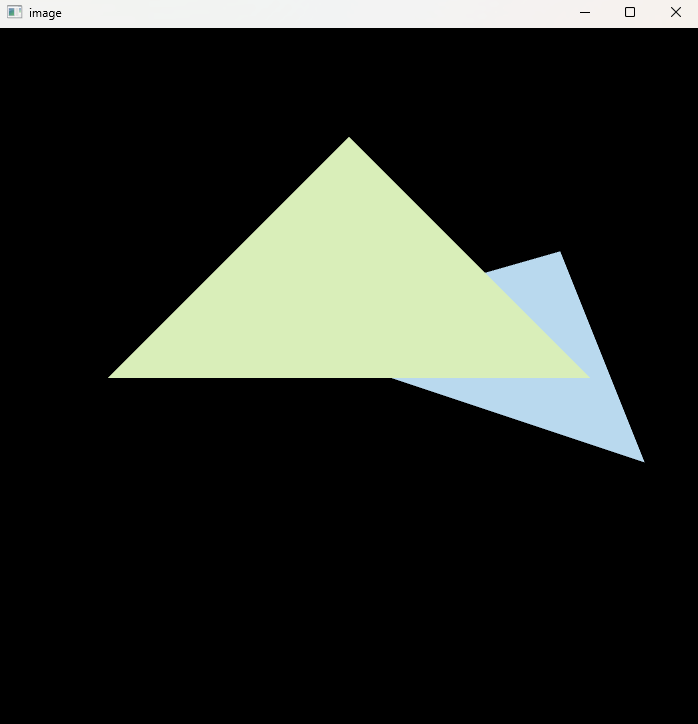
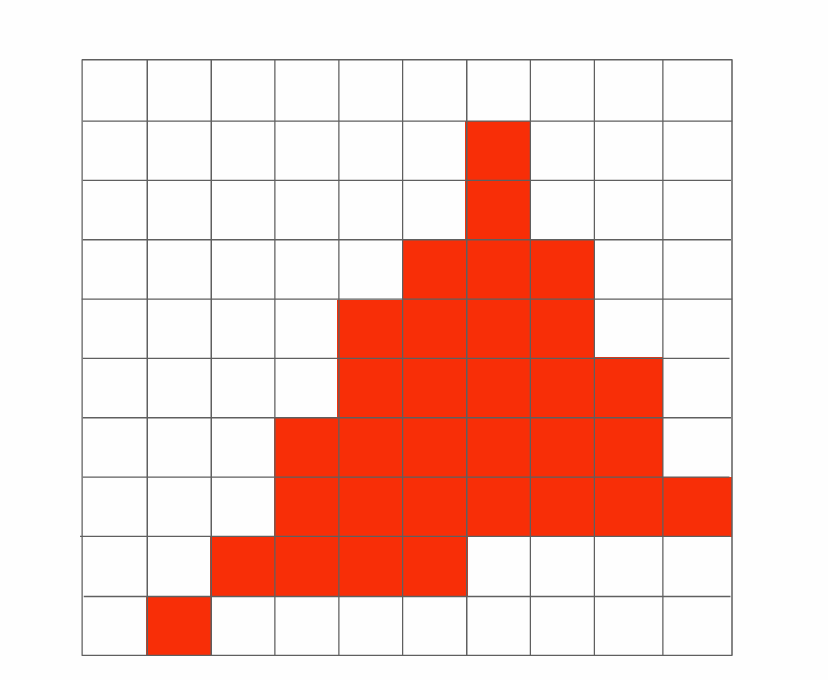
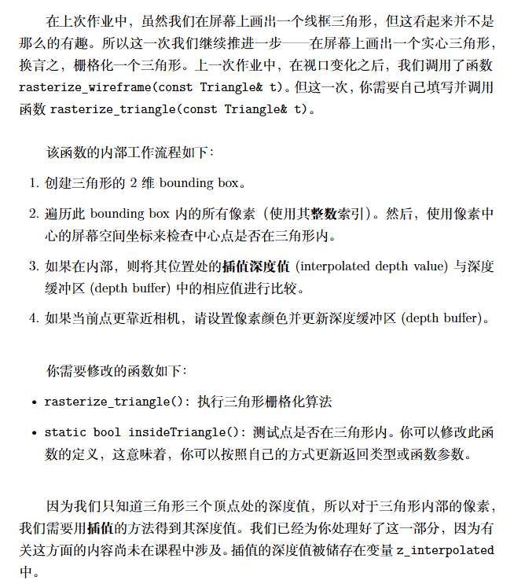
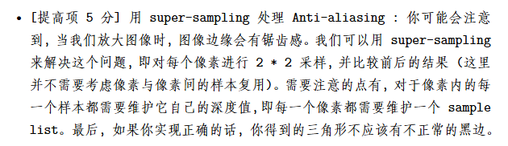

> [!CAUTION]
>
> **免责声明：此文章为记录自主学习图形学机制而留，并没有提交到BSS论坛，请勿直接复制粘贴，后果自负。**

## HomeWork1：MVP矩阵
作业的最终效果如下：就是让我们画一个三角形，作业包已经完成了大部分的内容，所以我们最后只用填入模型的变换矩阵M和投影矩阵P

### 什么是MVP矩阵？
在计算机图形学中，我们用向量表示一个点，用向量表示一个虚拟世界，而最后这些模型有些会进入我们的屏幕而有的不会，这就是经历了mvp矩阵变换的结果。
顾名思义：m代表模型矩阵，用来表示模型的空间位置；v代表观测变换，表示我们用照相机产生的一个视野,为了方便实现,挪动相机实际上就是挪动整个世界而相机不动;P代表投影,类似于最后成像的方式
#### 仿射变换
实际上M和V矩阵都是让世界物体做仿射变换,那什么是仿射变换?
简单来说就是平移+旋转+放缩三种变换的统称,我们用矩阵表示就是:

$$
\begin{bmatrix}
x' \\
y' \\
z' \\
1
\end{bmatrix}
=
\begin{bmatrix}
 &  &  & t_x \\
 & R &  & t_y \\
 &  &  & t_z \\
0 & 0 & 0 & 1
\end{bmatrix}
\begin{bmatrix}
x \\
y \\
z \\
1
\end{bmatrix}
$$
其中$R$表示旋转/缩放的部分,$t_x,t_y,t_z$是平移。
为了更直观,我们把三种基本变换拆开写:
平移矩阵:
$$
T(\Delta x,\Delta y,\Delta z)=
\begin{bmatrix}
1 & 0 & 0 & \Delta x \\
0 & 1 & 0 & \Delta y \\
0 & 0 & 1 & \Delta z \\
0 & 0 & 0 & 1
\end{bmatrix}
$$
绕$z$轴旋转:
$$
R_z(\theta)=
\begin{bmatrix}
\cos\theta & -\sin\theta & 0 & 0 \\
\sin\theta & \cos\theta & 0 & 0 \\
0 & 0 & 1 & 0 \\
0 & 0 & 0 & 1
\end{bmatrix}
$$
绕$x$轴旋转:
$$
R_x(\theta)=
\begin{bmatrix}
1 & 0 & 0 & 0 \\
0 & \cos\theta & -\sin\theta & 0 \\
0 & \sin\theta & \cos\theta & 0 \\
0 & 0 & 0 & 1
\end{bmatrix}
$$
绕$y$轴旋转:
$$
R_y(\theta)=
\begin{bmatrix}
\cos\theta & 0 & \sin\theta & 0 \\
0 & 1 & 0 & 0 \\
-\sin\theta & 0 & \cos\theta & 0 \\
0 & 0 & 0 & 1
\end{bmatrix}
$$
实际上还有绕任意轴旋转的矩阵(罗德里格斯旋转公式):
$$
R_{\mathbf{u}}(\theta)=I\,c+(1-c)\,\mathbf{u}\mathbf{u}^T+s\,[\mathbf{u}]_\times
$$
其中$\mathbf{u}=(u_x,u_y,u_z)$为单位向量,$c=\cos\theta,s=\sin\theta$,
$$
[\mathbf{u}]_\times=
\begin{bmatrix}
0 & -u_z & u_y \\
u_z & 0 & -u_x \\
-u_y & u_x & 0
\end{bmatrix}
$$
缩放矩阵:
$$
S(s_x,s_y,s_z)=
\begin{bmatrix}
s_x & 0 & 0 & 0 \\
0 & s_y & 0 & 0 \\
0 & 0 & s_z & 0 \\
0 & 0 & 0 & 1
\end{bmatrix}
$$
这三种矩阵按顺序相乘就是模型矩阵$M$。注意矩阵相乘是有顺序的,例如先旋转再平移和先平移再旋转效果不一样。
#### 观测矩阵V
将三维的点集由世界坐标变换为相机坐标；
相机有如下几种属性：位置$\vec{e}$ ，视线方向$\hat{g}$ ，向上方向$\hat{t}$ （假设与视线方向垂直）
我们将原坐标系变换为相机坐标系，并符合如下规则：相机在原点、向上方向为 $y+$ ，视线方向为 $z-$ （$x+$ is $\hat{g}\times\hat{t}$, $y+$ is $\hat{t}$, $z+$ is $-\hat{g}$）；
假设变换矩阵为 $M_{view}$ ，考虑其的形式（$M_{view}=R_{view}T_{view}$）：首先需要将相机点移到原点（$T_{view}=T(-\vec{e})$），再进行坐标轴变换；
考虑 $R_{view}^{-1}$ 即从相机坐标系变换回原坐标系：参考
$$
R_{view}^{-1}=
\begin{bmatrix}
x_{\hat{g}\times\hat{t}} & x_{\hat{t}} & x_{-\hat{g}} & 0 \\
y_{\hat{g}\times\hat{t}} & y_{\hat{t}} & y_{-\hat{g}} & 0 \\
z_{\hat{g}\times\hat{t}} & z_{\hat{t}} & z_{-\hat{g}} & 0 \\
0 & 0 & 0 & 1
\end{bmatrix}
$$
得：
$$
R_{view}=
\begin{bmatrix}
x_{\hat{g}\times\hat{t}} & x_{\hat{t}} & x_{-\hat{g}} & 0 \\
y_{\hat{g}\times\hat{t}} & y_{\hat{t}} & y_{-\hat{g}} & 0 \\
z_{\hat{g}\times\hat{t}} & z_{\hat{t}} & z_{-\hat{g}} & 0 \\
0 & 0 & 0 & 1
\end{bmatrix}
$$
#### 投影矩阵P
投影的作用是把3D的物体压到2D平面上。可以分成两步:透视到正交,再做正交投影。
具体来说：正交投影就是把将$z$坐标写为0之后把$(-\infty,+\infty)^2$的物体写入$[-1,+1]^3$的标准立方体中,投影出来的效果不符合现实世界观察近大远小的规律<br>而透视投影就是模拟真实世界观测的效果(近大远小,平行线看着不平行)具体做法就是将一个以原点为锥点的截锥体变换成立方体，再进行正交投影，就完成了透视投影的过程.

1) 透视到正交的变换:
$$
M_{persp\to ortho}=
\begin{bmatrix}
z_{near} & 0 & 0 & 0 \\
0 & z_{near} & 0 & 0 \\
0 & 0 & z_{near}+z_{far} & -z_{near}z_{far} \\
0 & 0 & 1 & 0
\end{bmatrix}
$$
2) 正交投影把视锥体挤到标准立方体里。设视角为$\text{fov}$,宽高比为$\text{aspect}$,近远平面为$z_{near},z_{far}$,
则上/下/左/右边界为:
$$
t=|z_{near}|\tan\left(\frac{\text{fov}}{2}\right),\quad
b=-t,\quad
r=t\cdot \text{aspect},\quad
l=-r
$$
正交投影矩阵:
$$
M_{ortho}=
\begin{bmatrix}
\frac{2}{r-l} & 0 & 0 & -\frac{r+l}{r-l} \\
0 & \frac{2}{t-b} & 0 & -\frac{t+b}{t-b} \\
0 & 0 & \frac{2}{z_{near}-z_{far}} & -\frac{z_{near}+z_{far}}{z_{near}-z_{far}} \\
0 & 0 & 0 & 1
\end{bmatrix}
$$
最终的投影矩阵就是:
$$
P=M_{ortho}M_{persp\to ortho}
$$
### MVP合成
在代码里我们把三个矩阵按顺序乘起来,就是:
$$
MVP=P\,V\,M
$$
最后顶点经过$MVP$变换,再做一次齐次除法(除以$w$)就可以得到屏幕上的点了。
在了解这些前置知识之后，我们就可以开始作业1了<br>
发现作业的基础项只需要我们完成两个函数`get_model_matrix`与`get_projection_matrix`这两个函数一个对应模型的位移，另一个则对应透视投影，我们直接将上文中的公式代入，得到：
```cpp
Eigen::Matrix4f get_model_matrix(float rotation_angle)
{
    using std::cos,std::sin;
    Eigen::Matrix4f model = Eigen::Matrix4f::Identity();

    // TODO: Implement this function
    // Create the model matrix for rotating the triangle around the Z axis.
    // Then return it.
    float rta=rotation_angle/180.0*MY_PI;
    transformer<<cos(rta),-sin(rta),0,0,
                 sin(rta),cos(rta), 0,0,
                 0,       0,        1,0,
                 0,       0,        0,1;
    
    model=transformer*model;
    return model;
}
Eigen::Matrix4f get_projection_matrix(float eye_fov, float aspect_ratio, float zNear, float zFar)
{
    Eigen::Matrix4f projection = Eigen::Matrix4f::Identity();

    // 注意：第四行第三列改为-1，适配右手系相机看向-Z
    Eigen::Matrix4f M_persp;
    M_persp <<
        zNear, 0, 0, 0,
        0, zNear, 0, 0,
        0, 0, zNear + zFar, -zFar * zNear,
        0, 0, -1, 0; 

    float half_fov = 0.5f * eye_fov * MY_PI / 180.0f;
    float t = zNear * std::tan(half_fov); 
    float r = t * aspect_ratio;            
    float b = -t;                        
    float l = -r;                       

    // 注意 Z 轴：n = -zNear, f = -zFar
    float n = -zNear;
    float f = -zFar;

    Eigen::Matrix4f M_ortho;
    M_ortho <<
        2/(r-l), 0,       0,       -(r+l)/(r-l),
        0,       2/(t-b), 0,       -(t+b)/(t-b),
        0,       0,       2/(n-f), -(n+f)/(n-f),
        0,       0,       0,       1;

    projection = M_ortho * M_persp;

    return projection;
}
```
关于提高项： 其实就是运用上文的罗德里格斯旋转公式，我们将公式代入得到：
```cpp
Eigen::Matrix4f get_rotation(Eigen::Vector3f axis, float angle) {

    Eigen::Matrix4f ans = Eigen::Matrix4f::Identity();
    Eigen::Matrix3f one;
    one << 1,0,0, 
           0,1,0, 
           0,0,1;

    float alpha = angle / 180 * MY_PI;
    float cs = cos(alpha), sn = sin(alpha);
    float x = axis[0], y = axis[1], z = axis[2];
    Eigen::Matrix3f cross;
    cross << 0,-z,y, 
             z,0,-x, 
             -y,x,0;

    Eigen::Matrix3f tmp = cs*one + (1-cs)*axis*axis.transpose() + sn*cross;

    for(int i = 0;i < 4;i ++) {
        for(int j = 0;j < 4;j ++) {
            if(i < 3 && j < 3)
                ans(i,j) = tmp(i,j);
            else if(i == 3 && j == 3)
                ans(i,j) = 1;
            else
                ans(i,j) = 0;
        }
    }
    return ans;
}
```
调用也很简单：我们只需要:`Eigen::Matrix4f transformer=get_rotation(Eigen::Vector3f(0,0,1),rotation_angle);`就可以实现绕z轴旋转
## Homework2：采样和z-buffering
第二个作业的最终效果如下图：
<br>
在上一个作业中，我们只完成了MVP矩阵，让这些图形全都在一个$[-1,1]^3$的标准立方体中，但实际上，我们最终是要把图形打到一个二维平面上，而采样就是在完成这一过程。
我们知道，屏幕实际上就是一些像素整齐的排列成矩阵，我们把像素排列抽象成一个的矩阵<br>
### 视口变换（Viewport Transformation）
经过MVP变换后，顶点位于$[-1,1]^3$的立方体中。为了将这些坐标映射到实际的屏幕像素坐标，我们需要进行视口变换。
视口变换将NDC坐标映射到屏幕坐标系，其中屏幕左下角为$(0,0)$，右上角为$(width, height)$。视口矩阵$M_{viewport}$定义为：
$$
M_{viewport} =
\begin{bmatrix}
\frac{w}{2} & 0 & 0 & \frac{w}{2} + x \\
0 & \frac{h}{2} & 0 & \frac{h}{2} + y \\
0 & 0 & \frac{1}{2} & \frac{1}{2} \\
0 & 0 & 0 & 1
\end{bmatrix}
$$
其中：
- $w$ 是视口的宽度
- $h$ 是视口的高度
- $x, y$ 是视口左下角在屏幕上的坐标（通常为0）
这样，正方体中的点$(x_{ndc}, y_{ndc}, z_{ndc})$经过视口变换后变为屏幕坐标$(x_{screen}, y_{screen}, z_{screen})$。
### 采样和光栅化
采样是将连续的几何体转换为离散的像素的过程。这个过程称为光栅化。
#### 基本步骤
1. **边界框计算**：为每个三角形计算其在屏幕上的轴对齐边界框（Axis-Aligned Bounding Box, AABB），以减少需要检查的像素数量。
2. **像素采样**：对于边界框内的每个像素，检查像素中心是否位于三角形内部。课里面教的是直接顺时针的方向和三角形里的每个点进行叉乘，若全部同号则在三角形内部，但是不太好处理叉积=0的情况，所以在这里介绍使用重心坐标来判断：
   - 三角形三个顶点为$\mathbf{v}_0, \mathbf{v}_1, \mathbf{v}_2$
   - 对于像素中心点$\mathbf{p}$，计算重心坐标$(\alpha, \beta, \gamma)$
   - 如果$\alpha \geq 0, \beta \geq 0, \gamma \geq 0$，则点在三角形内

   重心坐标可以通过叉积计算：
   $$
   \alpha = \frac{ (\mathbf{v}_1 - \mathbf{v}_0) \times (\mathbf{p} - \mathbf{v}_0) }{ (\mathbf{v}_1 - \mathbf{v}_0) \times (\mathbf{v}_2 - \mathbf{v}_0) }
   $$
   我们可以用同样的方式计算$\beta, \gamma$。
3. **属性插值**：对于在三角形内的像素，使用重心坐标插值顶点属性，如颜色、纹理坐标等。
4. **深度插值**：同样使用重心坐标插值深度值，用于z-buffering。
### Z-Buffering
Z-Buffering是一种解决可见性问题的算法，用于确定哪个像素在前。
- 维护一个深度缓冲区，大小与屏幕像素相同，初始值为无穷大（表示最远）。
- 对于每个像素，如果其插值深度小于缓冲区中的值，则更新缓冲区并绘制该像素。
- 这样确保了近的物体覆盖远的物体。
### 反走样
如果我们直接按照上述的朴素算法渲染图形，最后打在画面上的结果就会这样：<br>这明显不是我们想要的效果！因此我们引入反走样
反走样（Anti-Aliasing，AA）用于减弱光栅化后出现的锯齿。常见策略有三类：
- 超采样（SSAA）：对每个像素做多次子像素采样并平均，简单但计算量大；
- 多重采样（MSAA）：对深度/覆盖做多样本采样、对颜色按片元计算，降低开销；
- 屏幕空间后处理（FXAA/SMAA）：基于像素图像做边缘检测与滤波，速度快但可能模糊细节。
- 时域抗锯齿（TAA）：类似于在时域上进行多重采样。
#### 简单2×2SSAA
对每个像素采样 4 个子样本，常用位置（以像素左下为 (0,0)）为：
$(0.25,0.25),(0.75,0.25),(0.25,0.75),(0.75,0.75)$。
#### MSAA与后处理
- MSAA：为每像素维护 N 个样本的深度/覆盖，着色器通常按片元执行一次，覆盖到被占据的样本；
- FXAA/SMAA：基于最终图像的边缘检测与滤波，代价低、易集成，但属于近似方法，会影响锐利细节。
了解这些前置知识之后，我们来到作业2:<br>我们直接实现提高项：实现一个2x2的ssaa<br>
我们先实现判断一个点是否在三角形内部的函数`insideTriangle`参考上文，我们使用重心坐标法实现:
```cpp
Eigen::Vector3f computeBarycentric(float x, float y, const Vector3f *v) {
    auto area2 = [](const Vector3f &a, const Vector3f &b, const Vector3f &c) {
        return (b.x()-a.x()) * (c.y()-a.y()) - (b.y()-a.y()) * (c.x()-a.x());
    };

    Vector3f P(x, y, 0);
    float A = area2(v[0], v[1], v[2]);
    if (std::fabs(A) < 1e-8f) return Eigen::Vector3f(-1, -1, -1); 

    float alpha = area2(P, v[1], v[2]) / A;
    float beta  = area2(P, v[2], v[0]) / A;
    float gamma = 1.0f - alpha - beta; 
    return Eigen::Vector3f(alpha, beta, gamma);
}
static bool insideTriangle(float x, float y, const Vector3f *_v)
{
    Eigen::Vector3f bary = computeBarycentric(x, y, _v);
    if (bary.x() < -0.5f) return false; 
    return (bary.x() >= -0.0000001 && bary.y() >= -0.0000001 && bary.z() >= -0.0000001);
}
```
在正式实现光栅化之前，我们要先修改hpp的对象结构，我们需要额外的维护一个`std::vector< std::vector<std::pair<float, Eigen::Vector3f>> > depColor`来维护深度测试当前最前面的颜色，为了代码美观，我还额外定义了一个`N=2`来表示当前ssaa的分割数
参照上文，我们要先判断这个三角形的AABB包围盒来减少像素计算数量，然后再对内部进行细分，每个点进行一次采样和深度测试，更新`depcolor`的值，在做完ssaa之后，记得调用`set_pixel`函数来设置像素值
```cpp
void rst::rasterizer::rasterize_triangle(const Triangle& t) {
    auto v = t.toVector4();
    
    // TODO : Find out the bounding box of current triangle.
    // iterate through the pixel and find if the current pixel is inside the triangle

    // If so, use the following code to get the interpolated z value.
    //auto[alpha, beta, gamma] = computeBarycentric2D(x, y, t.v);
    //float w_reciprocal = 1.0/(alpha / v[0].w() + beta / v[1].w() + gamma / v[2].w());
    //float z_interpolated = alpha * v[0].z() / v[0].w() + beta * v[1].z() / v[1].w() + gamma * v[2].z() / v[2].w();
    //z_interpolated *= w_reciprocal;

    // TODO : set the current pixel (use the set_pixel function) to the color of the triangle (use getColor function) if it should be painted.

    double minX, maxX, minY, maxY;
    minX = maxX = v[0][0];
    minY = maxY = v[0][1];  
    for(int i = 0;i < 3;i ++) {
        minX = std::min(minX, (double)v[i][0]);
        maxX = std::max(maxX, (double)v[i][0]);
        
        minY = std::min(minY, (double)v[i][1]);
        maxY = std::max(maxY, (double)v[i][1]);
    }

    int ixMin = std::max(0, (int)minX);
    int ixMax = std::min(width - 1, (int)maxX);
    int iyMin = std::max(0, (int)minY);
    int iyMax = std::min(height - 1, (int)maxY);

    for(int ix = ixMin; ix <= ixMax; ix ++) {
        for(int iy = iyMin; iy <= iyMax; iy ++) {
            int id = 0;
            for(int i = 0;i < N;i ++) {
                for(int j = 0;j < N;j ++) {
                    float d = 1.0 / (2 * N);
                    float x = ix + 2 * d * i + d, y = iy + 2 * d * j + d;
                    if(insideTriangle(x, y, t.v)) {
                        auto[alpha, beta, gamma] = computeBarycentric2D(x, y, t.v);
                        float w_reciprocal = 1.0/(alpha / v[0].w() + beta / v[1].w() + gamma / v[2].w());
                        float z_interpolated = alpha * v[0].z() / v[0].w() + beta * v[1].z() / v[1].w() + gamma * v[2].z() / v[2].w();
                        z_interpolated *= w_reciprocal;

                        if(depColor[get_index(ix, iy)][id].first > z_interpolated) {
                            depColor[get_index(ix, iy)][id].first = z_interpolated;
                            depColor[get_index(ix, iy)][id].second = t.getColor();
                        }
                    }

                    id ++;
                }
            }

            Eigen::Vector3f color = {0, 0, 0};
            id = 0;
            for(int i = 0;i < N;i ++) {
                for(int j = 0;j < N;j ++) {
                    color += depColor[get_index(ix, iy)][id].second;
                    id ++;
                }
            }

            color /= N*N;
            set_pixel(Eigen::Vector3f(ix, iy, 1), color);
        }
    }
}
```
致此，我们把3D图形的变换以及把图形打到屏幕上的过程走通了一遍，但这还不是完整的渲染管线，实际上，我们一直没有考虑到着色的情况，这也是接下来的课程和作业所关注的
